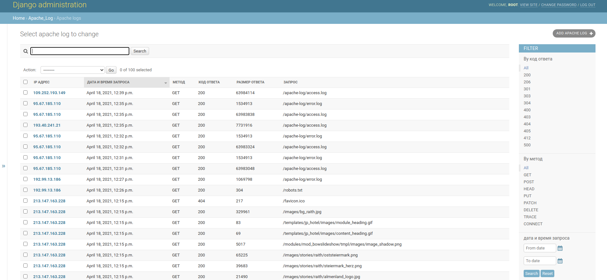

# Обработка и агрегация Apache лога.

Загрузка лога Apache через http и просмотр в Django Admin



## Переменные окружения

Часть настроек проекта берётся из переменных окружения. Чтобы их определить, создайте файл `.env` в директорией с проектом и запишите туда данные в таком формате: `ПЕРЕМЕННАЯ=значение`.

Доступны переменные:
- `DEBUG` — дебаг-режим. Поставьте `True`, чтобы увидеть отладочную информацию в случае ошибки.
- `SECRET_KEY` — секретный ключ проекта
- `SQL_ENGINE` — движок базы данных
- `SQL_DATABASE` — название БД
- `SQL_USER` — пользователь БД
- `SQL_PASSWORD` — пароль БД
- `SQL_HOST` — хост БД
- `SQL_PORT` — порт БД

Пример файла:
```buildoutcfg
DEBUG=TRUE
SECRET_KEY='asdghesfgderwgdfb'
SQL_ENGINE=django.db.backends.postgresql
SQL_DATABASE=log_db
SQL_USER=django_user
SQL_PASSWORD=django_password
SQL_HOST=db
SQL_PORT=5432
```

## Запуск

- Скачайте репозиторий
- Запустите проект через docker-compose
```
docker-compouse up --build -d
```

Примените миграции
```
docker-compose exec app python3 manage.py migrate 
```

- Создайте супер пользователя
```bash
docker-compose exec app python3 manage.py createsuperuser 
```


## Добавление данных

- Запустите загрузку командой 
  ```
  docker-compose exec app python3 manage.py load_apache_log http://www.almhuette-raith.at/apache-log/access.log

  ```


## Цели проекта

Код написан как тестовая задача для компании Brandquad.